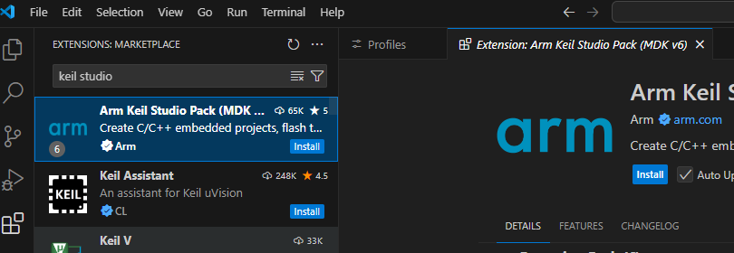
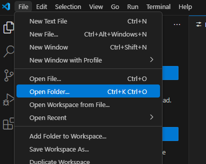
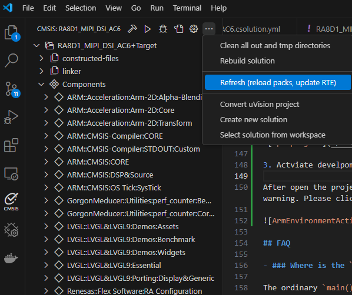
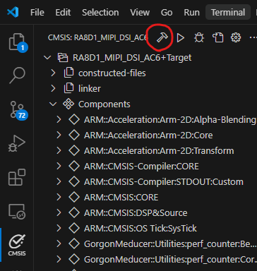

# MDK Template for EK-RA8D1

This is a **modified** MDK project template for EK-RA8D1. For the moment I writing this document (14 Dec 2023), the RA-generated MDK projects have some known limitations:

- Only supports **microLib** (this has some performance impact)
- Does NOT fully follow the standard scatter-loading and C-library startup procedure suggested by the CMSIS standard.
- DCache is disabled by default (this has a significant performance impact)
- ITCM and DTCM only accept contents that are placed in dedicated sections `.dtcm_data.*` and `.item_data.*`. Otherwise, BusFult will be triggered. 
- Numerous warnings are thrown out once **Link-Time-Optimization** is enabled, although they are safe to ignore. (This prevents users from allowing Arm Compiler 6 to do further optimization possible)


To buy time for the Renesas Team to solve the issue and to provide a template for evaluation purposes, we modified an RA-generated MDK project and patched the issues aforementioned.

### Feature

- Complaint with CMSIS standard
- DTCM and ITCM are available for random access without special procedures
- Supports both microlib and normal C library
- Free to use All available optimization levels (including -Omax and -Omin)
- Integrates [`perf_counter`](https://github.com/GorgonMeducer/perf_counter) and ready to run [`Coremark`](https://github.com/eembc/coremark)
- Ready to evaluate [`Arm-2D`](https://github.com/ARM-software/Arm-2D) and provides demos.
- Validated with [FSP 4.4.0](https://github.com/renesas/fsp/releases/tag/v4.4.0)
- [Added] Complaint with [CMSIS-Toolbox](https://github.com/Open-CMSIS-Pack/cmsis-toolbox) & MDK6


## How to Use

### How to Deploy

1. Download the latest [MDK](https://www.keil.com/download/product/) and install the [community license](https://www.keil.com/pr/article/1299.htm) if you haven't have a valid license yet. 

2. Clone the project with the following command line:

```shell
git clone https://github.com/roychen-arm/EK-RA8D1-MDK6
```

3. Install required cmsis-packs
   - [FSP 4.4.0](https://github.com/renesas/fsp/releases/tag/v4.4.0) : MDK_Device_Packs
   - Pack Installer: `Perf_counter`

4. Enter the folder `EK-RA8D1` and open the project `RA8D1_MIPI_DSI_AC6.uvprojx`.

5. Compile.

If everything goese well, you should see the following output in Build Output window:

 

Congratulations!


### How to Run Arm-2D Demos

1. Right click the group `demos` in project view (as shown below):

 


Select `Options for Group demos `. Ensure the option  `Include in Target Build` is selected.

 

2. Open `Manage Run-Time Environment` window in menu.

 

Expand `Arm-2D Helper` and set the `Display Adapter` to `1` and set the `Scene` to `6` (as we have 6 pre-built scenes for demonstration). Before close the window, press `Resolve` button to resolve warnings in yellow.

3. Compile and debug. 


### How to Run Coremark

1. Right click the group `demos` in project view (as shown below):

 


Select `Options for Group demos `. Ensure the option  `Include in Target Build` is unselected.

 

2. Open `Manage Run-Time Environment` window in menu. Expand `Arm-2D`,`Arm-2D Extras` and ` Arm-2D Helper`. Unselect all components,  set the `Display Adapter` to 0 and set the `Scene` to `0` as shown below:

 

Expand `Utilities::perf_counter` , select both `Benchmark::Coremark` and `Core::Source`. Click OK to close the window.


3. Compile and debug.  You can find the coremark report in `Debug (printf) View` after entering the debug mode. 


### How to build with CMSIS Toolbox
[CMSIS-Toolbox](https://github.com/Open-CMSIS-Pack/cmsis-toolbox/tree/main) is the open source tools which provide a set of command-line tools to work with software packs in Open-CMSIS-Pack format.

1. Install [vcpkg](https://learn.arm.com/learning-paths/microcontrollers/vcpkg-tool-installation/installation/) which is used to deploy tools and environment easily.
```shell
. <(curl https://aka.ms/vcpkg-init.sh -L)
```

If you already installed vcpkg before, just run the command to initialize vcpkg instead.
```shell
. ~/.vcpkg/vcpkg-init
```

2. Activate the enviroment. It will automatically download the requred tools defined in [vcpkg-configuration.json](./vcpkg-configuration.json) and setup the enviroment variable.
```shell
vcpkg-shell activate
```

3. Use the `cbuild` command to build the project.
```shell
cbuild ./RA8D1_MIPI_DSI_AC6.csolution.yml --context-set --update-rte --packs
```
>**Note:** During the build process required packs may be downloaded.

You can refer [`CMSIS Project Manager - Users Manual`](https://github.com/Open-CMSIS-Pack/cmsis-toolbox/blob/main/docs/build-overview.md) for more detail usage of cpackget/csolution/cbuild.

### How to build with VS Code
[Keil MDK 6](https://www.keil.arm.com/keil-mdk/) contains [Keil Studio (VS Code Extensions)](https://marketplace.visualstudio.com/items?itemName=Arm.keil-studio-pack) which compatible with CMSIS-Toolbox.
Users can use VS Code IDE for CMSIS based project development.

1. Install VS Code Extensions in VS Code
Search `Arm Keil Studio` in VS Code Extensions tab and install it.

 

Once you installed Keil Studio extension, you will see `CMSIS` and `Device Manager` on side tab

 


2. Open the project with VS Code

On VS Code menu, `File` -> `Open`. then assign the path you clone the project.

 

3. Actviate develpoment environment

After open the project, you will see the `Arm Environment Activation` warning. Please click `Allow for Current Workspace` or `Alwas Allow`

 

4. Refresh the Project for constructed-files

In case the `constructed-files`(RTE_Components.h, Pre_Include_Global.h, etc.) are not generated automatically, Move to `CMSIS` tab and click `Refresh (reload packs, update RTE)` under `...`.



5. Build the project with VS Code

Click the build icon to build the project.



## FAQ

- ### Where is the `main()` function?

The ordinary `main()` is hidden in this project, instead, using the `hal_entry()` is suggested by Renesas. In this project, all user code is placed in function `mipi_dsi_start_display()`.

- ### How to place data and/or code to TCMs?

  - Placing data to DTCM

    You can place variables to DTCM by applying the `__attribute__((section(".dtcm_data")))`. For data with different attributes, e.g. RO, RW or ZI, you can use the following attributes:

    ```c
    __attribute__((section(".dtcm_data.ro")))
    const char example_string[]={"hello world\r\n"};
    
    __attribute__((section(".dtcm_data.rw")))
    int32_t example_look_up_table[] = {2,3,5,7,11,13,17,19};
    
    __attribute__((section(".dtcm_data.zi")))
    uint8_t example_buffer[512];
    ```

    or some unique section name with the pattern `.dtcm_data.xxxx`. 

  - Placing code to ITCM

    You can place code to ITCM by applying the  `__attribute__((section(".itcm_data")))` before the function. 

    **NOTE: STACK and HEAP have already been placed at DTCM.**

- ### How to Change STACK and HEAP size?

    Open the header file `bsp_cfg.h` and 

    - modify the macro `BSP_CFG_STACK_MAIN_BYTES` to adjust the stack size.
    - modify the macro `BSP_CFG_HEAP_BYTES` to adjust the heap size.

